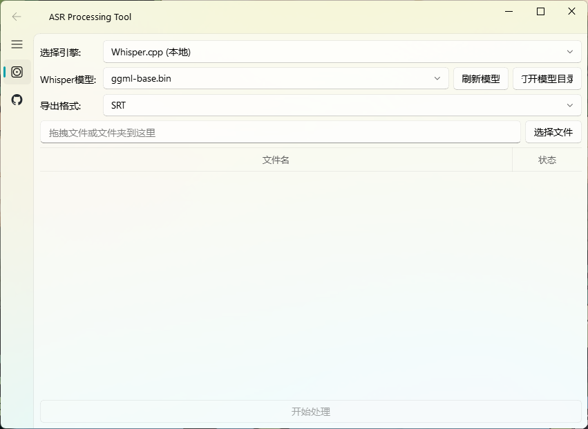

# 🎤 AsrTools

基于AsrTools修改
- 修复J接口
- 加入Whisper本地模式

## 🌟 **使用**
下载项目点击 `启动ASR工具.bat`

### 界面操作

- **Whisper模型** 下拉框：自动列出 `resources\whisper\` 下所有可用模型
- **刷新模型** 按钮：放入新模型文件后点击，即时刷新列表
- **打开模型目录** 按钮：一键打开模型文件夹，方便放入新模型
-**B接口/J接口**按钮：保持联网使用

### 模型下载

可从 HuggingFace 下载 ggml 格式的 Whisper 模型：
- https://huggingface.co/ggerganov/whisper.cpp/tree/main

**主界面截图示例：**

